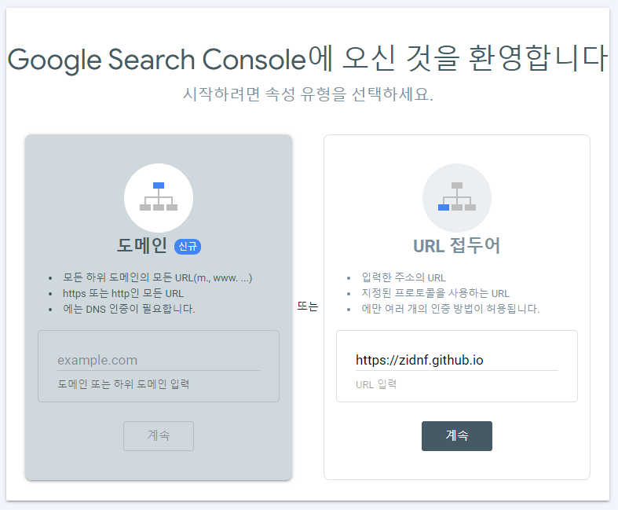
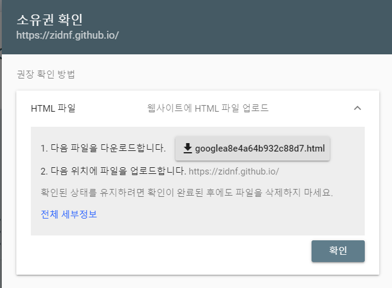
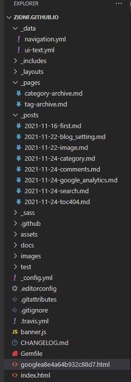

오늘은 구글, 네이버 검색엔진에 등록을 해보겠습니다

# google search

https://search.google.com/search-console/welcome
해당 링크에 오셔서

URL 접두어쪽에

자신이 github주소를 입력해 주시고 계속 버튼 클릭

화면에 나오는 html 파일을 다운받습니다

Visual Studio Code로 오셔서 다운받은 파일을 넣는데

사진처럼 트리 가장 상단

_posts나 index.html와 같은 Level 로서 존재하게 넣어주시면 됩니다

어느 폴더 안에 들어가 있으면 안됩니다

