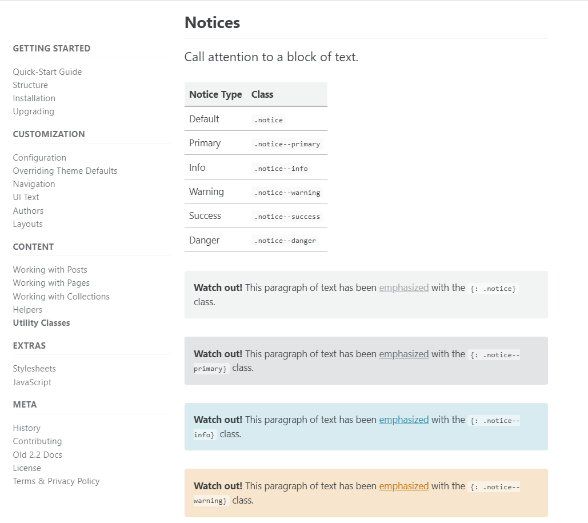

오늘은 공지사항, 버튼, 영상 추가하기를 해보겠습니다

# 1. 공지사항 (notice)

https://mmistakes.github.io/minimal-mistakes/docs/utility-classes/

주소에 오시면

여러가지 예시들이 있는데

본인이 원하시는 공지사항 글귀 뒤에 

{: . notice} 라는 속성을 적어주시면 됩니다

공지사항 예시
{: .notice--warning}

