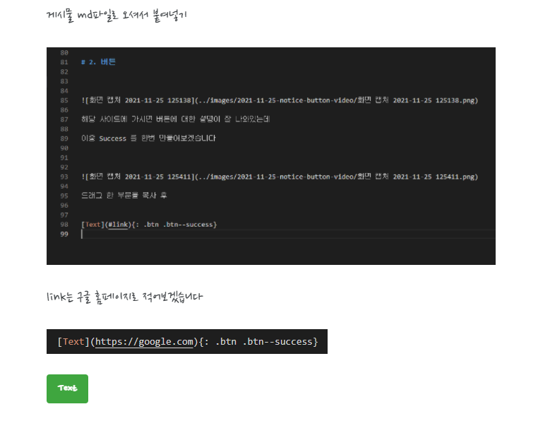
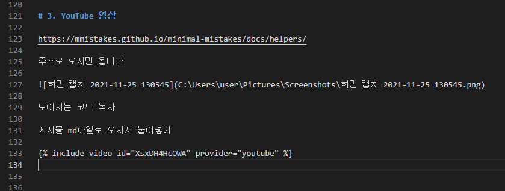
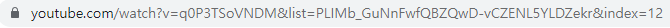
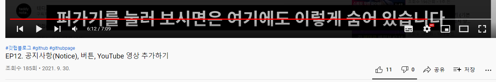
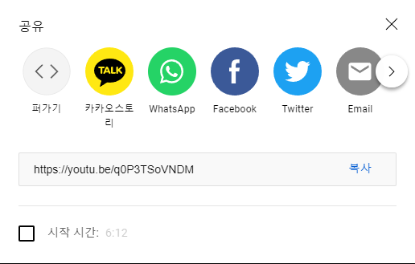
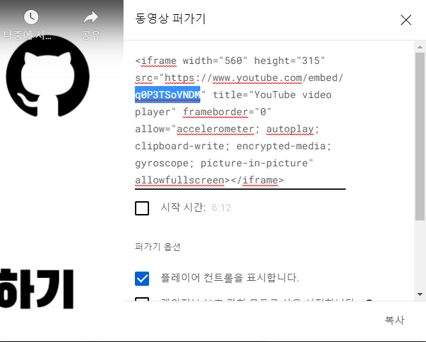
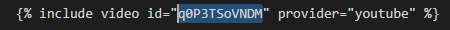

오늘은 공지사항, 버튼, 영상 추가하기를 해보겠습니다

# 1. 공지사항 (notice)

https://mmistakes.github.io/minimal-mistakes/docs/utility-classes/

주소에 오시면

여러가지 예시들이 있는데

공지사항 글귀 뒤에 

{}안에 

본인이 원하시는 설정값을 적어주시면 됩니다

저는 : .notice--warning 라는 설정값을 넣어주겠습니다

해당 게시물 md파일로 오셔서 

공지사항을 한번 적어보겠습니다

공지사항 예시
{: .notice--warning}

베너형식으로 나오게 됩니다

한줄이 아니라 여러줄에 적용하고 싶으시다면

가장 마지막 부분 

Notice Headline에 적혀있는것 처럼 

div테그로 감싸주시면 됩니다

공지사항 예시
이 안에는 html테그가 들어올 수 있으십니다
<ul>
    <li>예시1</li>
    <li>예시2</li>
</ul>

# 2. 버튼

해당 사이트에 가시면 버튼에 대한 설명이 잘 나와있는데

이중 Success 를 한번 만들어보겠습니다

드래그 한 부분을 복사

게시물 md파일로 오셔서 붙여넣기

link는 구글 홈페이지로 적어보겠습니다

[Text](https://google.com){: .btn .btn--success}

버튼이 생성되었고 버튼 클릭 시 

구글 홈페이지로 연결이 됩니다

# 3. YouTube 영상

https://mmistakes.github.io/minimal-mistakes/docs/helpers/

주소로 오시면 됩니다

보이시는 코드 복사

게시물 md파일로 오셔서 붙여넣기

id를 수정해주셔야 하는데
원하시는 영상 상단에 링크를 보시게 되면

watch?v= 뒤에 오는것이 id 입니다

링크가 제대로 나오시지 않으시면 해당 영상에 가셔서

오른쪽 하단 공유 클릭

퍼가기 선택

드래그한 부분이 id에 들어가면 됩니다



