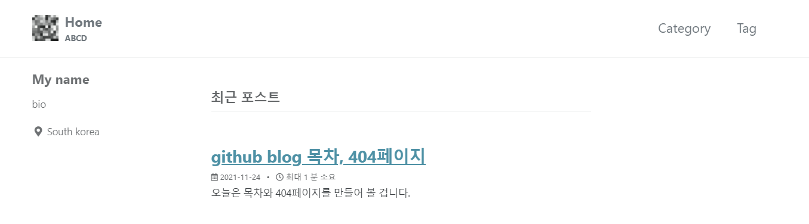
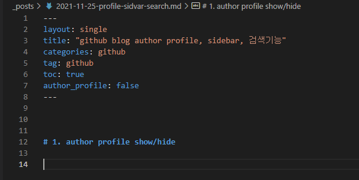
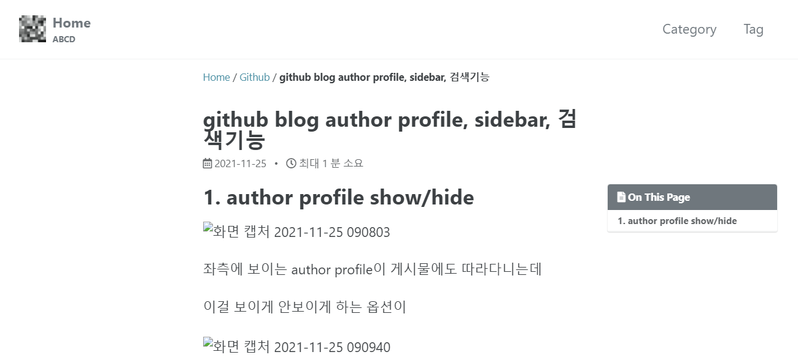
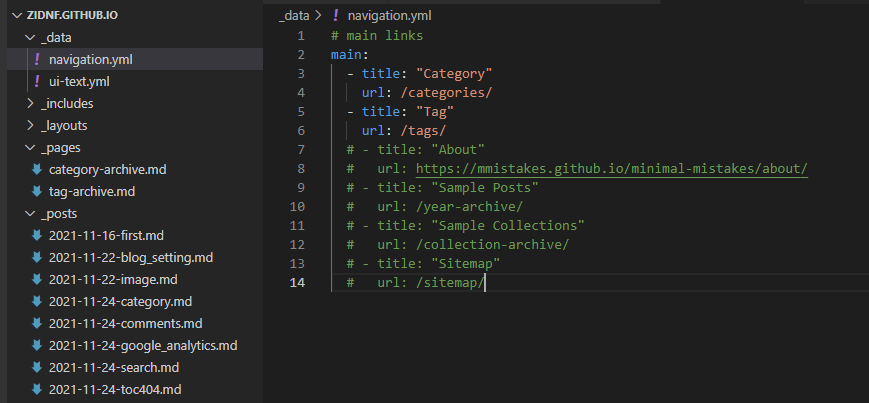
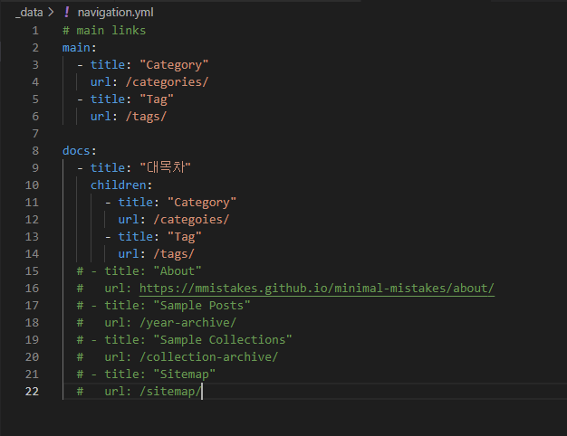
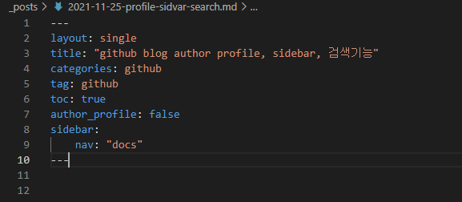

# 1. author profile show/hide

좌측에 보이는 author profile이 게시물에도 따라다니는데

이걸 보이게 안보이게 하는 옵션이

해당 md파일 상단에

author_profile: false를 주시는겁니다

author profile이 사라진것을 확인할 수 있습니다

# 2. sidebar navigation

author profile 대신 메뉴가 있는 sidebar로 변경이 가능한데

해당 게시물 md파일에

일단 author_profile: false 를 해주시고

_data폴더에 있는 navifation.yml 파일을 열어주세요

다 적으셨으면 다시 md파일로 돌아오셔서

sidebar:

​	nav: "docs"

설정을 해주시면 됩니다

